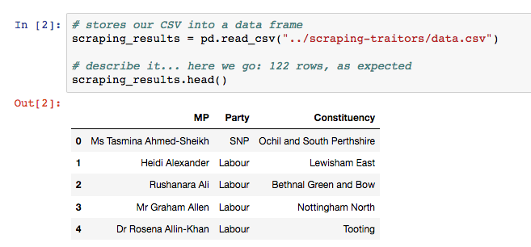

# 3.1: Simple scraping in Python

## recap from last week

### Python syntax

    # a variable
    foo = 'bar'
    
    # a list
    aList = [1,2,'lol']
    
    # an if statement
    if 'lol' in aList:
        print('element found')
    
    # a for loop
    for element in foo:
        if 'lol' is element:
            print element
            # > 'lol'

### web scraping with BeautifulSoup

    url = 'https://order-order.com/2017/02/08/named-122-mps-voted-brexit/'
    response = requests.get(url)
    
    # parses HTML
    html = response.content
    
    # magic method
    soup = BeautifulSoup(html, 'lxml')
    
    # now we can work
    soup.findAll('html elements')

## scraping traitors

### understanding the page structure

-   two <blockquote>
-   each contaning many <em>
-   each <em> containing our data points

### mostly, it looks like so

"name (party - constituency)"

eg 

    Martyn Day (Scottish National Party – Linlithgow and East Falkirk)
    Maria Eagle (Labour – Garston and Halewood)

### problems

-   a few \_Labour (Co-op)
-   one SNP- Inverness

This is the key issue with web scraping: dirty data!

### back to our notebook!

## scraping: recap

-   for each <em> in each <blockquote>
-   split the text in different ways to create our variables
-   add our variables to a list
-   add this list to another list (a list of list, then)
-   each list in our list of list is a row
-   write CSV file

## scraping: result!

## spotting traitors

Now that we've got our 122 names we want to see who betrayed their constituency: jump to \`spotting-traitors\`

### links we used

-   [merge types](https://www.shanelynn.ie/merge-join-dataframes-python-pandas-index-1/#mergetypes)
-   [useful pandas snippets](https://jeffdelaney.me/blog/useful-snippets-in-pandas/)

### reading

-   [more pandas, a course](https://www.datacamp.com/community/tutorials/exploratory-data-analysis-python)

