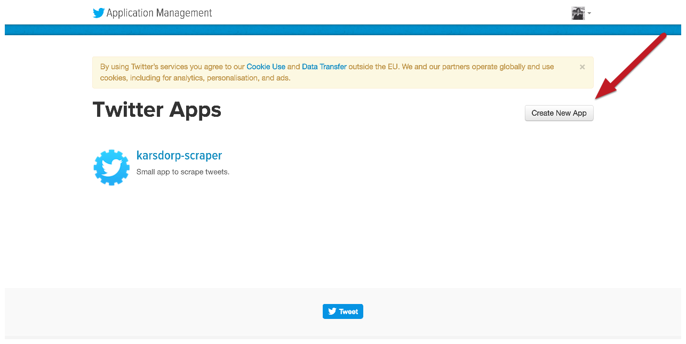

# 3.2: More complex scraping in Python?

## javascript exercise

> Build an interactive thing in Javascript, that responds to a user input.

## assessment update

-   still waiting on deadlines to be updated
-   are you clear on what the week 5 assessment is?
-   final project: two routes&#x2026;

## two routes for the final project

-   option one: build a full website
-   option two: host your content on Medium/blog/Wordpress

Obviously I will assess the two options differently, i.e.

-   if you do more website, front-end work, I will be kinder on the data work
-   if you do little website-building, your data work must be top notch!

## scraping, scraping!

### web scraping v API

[a simple comparison](https://www.grepsr.com/web-scraping-vs-api/):

-   is an API available/hidden?
-   is the API actually up-to-date?
-   rate limiting
-   but better structure

One thing to consider: the ethics of web scraping: see this recent [Ninth Circuit ruling](https://www.eff.org/deeplinks/2018/01/ninth-circuit-doubles-down-violating-websites-terms-service-not-crime) that violating a website's term of service is not a crime

### web scraping

[Every website can be scraped](https://blog.hartleybrody.com/web-scraping/)\*

-   if you're good enough

good practice: set headers in your web requests identifying yourself

    import requests
    
    headers = {'user-agent' : 'Mozilla/5.0 (Macintosh; Intel Mac OS X 10_9_5);
                 Basile Simon/ London/ basile.simon@thetimes.co.uk'}
    html = requests.get(url, headers=headers)

[A good tutorial](https://medium.freecodecamp.org/how-to-scrape-websites-with-python-and-beautifulsoup-5946935d93fe)

### API scraping

using an API is using an authorised service

## tools of the trade: the APIs

[even the Guardian has a piece about "what's an API"](https://www.theguardian.com/media/pda/2007/dec/14/thenutshellabeginnersguide)

> The exception are sites built on open source code, which is sort of like a **worldwide hippy commune** of developers who share their notes. The idea is that they can make better products and software if lots of people collaborate on a project.

good API example: [postcodes.io](https://postcodes.io/)

## setup

### register on twitter

-   log into your twitter account
-   register your phone number with your account
-   click on your profile pic (top left-hand side), then head to "Mobile"

### create your (first?) twitter app

<https://apps.twitter.com/>

that's a common way to keep control of who's allowed to use your service.
this way, they can shut your app down [if you abuse your privileges](https://www.theverge.com/2015/6/4/8731387/politwoops-sunlight-foundation-twitter)

### fill in application details

### DO NOT publish your API keys etc.

some people scrape the internet for published credentials. they could take over your account, post whatever they want in your name, including sending DMs. you've been warned.

## how to use an API?

-   read the documentation
-   find a convenient wrapper library that does the heavy lifting for you

in our case: that's [tweepy](http://tweepy.readthedocs.io/en/v3.5.0/getting_started.html), a wrapper library around the twitter API built in python.

### installing tweepy

    pip3 install tweepy

### more modules

    pip3 install pandas numpy matplotlib seaborn

[Getting started with tweepy](http://tweepy.readthedocs.io/en/v3.5.0/getting_started.html)

## notes from the session

-   [what's a dataframe?](https://pandas.pydata.org/pandas-docs/stable/dsintro.html#dataframe)
-   [mostly everything about pandas dataframes](https://www.datacamp.com/community/tutorials/pandas-tutorial-dataframe-python)
-   [a Series is one column of a dataframe](https://stackoverflow.com/questions/26047209/what-is-the-difference-between-a-pandas-series-and-a-single-column-dataframe)
-   [series and dataframes, cont.](https://medium.freecodecamp.org/series-and-dataframe-in-python-a800b098f68)
